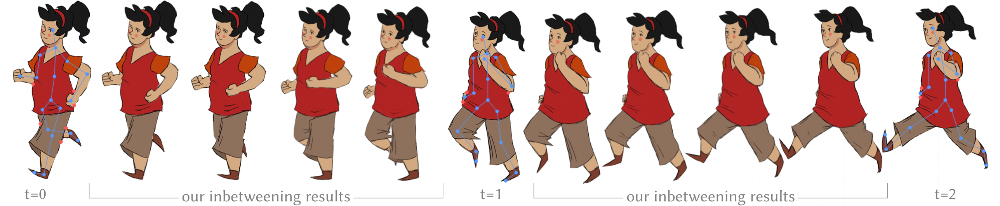

# Skeleton-Driven Inbetweening of Bitmap Character Drawings



One of the primary reasons for the high cost of traditional animation is the
inbetweening process, where artists manually draw each intermediate frame
necessary for smooth motion. Making this process more efficient has been at the
core of computer graphics research for years, yet the industry has adopted very
few solutions. Most existing solutions either require vector input or resort to
tight inbetweening; often, they attempt to fully automate the process. In
industry, however, keyframes are often spaced far apart, drawn in raster
format, and contain occlusions. Moreover, inbetweening is fundamentally an
artistic process, so the artist should maintain high-level control over it.

We address these issues by proposing a novel inbetweening system for bitmap
character drawings, supporting both _tight_ and _far_ inbetweening. In our setup,
the artist can control motion by animating a skeleton between the keyframe
poses. Our system then performs skeleton-based deformation of the bitmap
drawings into the same pose and employs discrete optimization and deep learning
to blend the deformed images. Besides the skeleton and the two drawn bitmap
keyframes, we require very little annotation.

However, deforming drawings with occlusions is complex, as it requires a
piecewise smooth deformation field. To address this, we observe that this
deformation field is smooth when the drawing is lifted into 3D. Our system
therefore optimizes topology of a 2.5D partially layered template that we use
to lift the drawing into 3D and get the final piecewise-smooth deformaton,
effectively resolving occlusions.

We validate our system through a series of animations, qualitative and
quantitative comparisons, and user studies, demonstrating that our approach
consistently outperforms the state of the art and our results are consistent
with the viewers' perception.

[Project Page](http://www-labs.iro.umontreal.ca/~bmpix/inbetweening/)

# Prerequisites

- [GNU/Linux](https://www.gnu.org/gnu/linux-and-gnu.en.html)
- [`python`](https://python.org)
- [`libigl`](https://github.com/libigl/libigl)
- [`eigen`](https://eigen.tuxfamily.org/index.php?title=Main_Page)
- [`pytorch`](https://pytorch.org/)
- [`gimp`](https://www.gimp.org/) (optional)
- [NVIDIA GPU] (optional, but highly recommended)
- `wget http://www-labs.iro.umontreal.ca/~bmpix/inbetweening/models.zip && unzip models.zip`
- `wget http://www-labs.iro.umontreal.ca/~bmpix/inbetweening/images.zip && unzip images.zip`

# Build

- clone [`libigl`](https://github.com/libigl/libigl) and build `cmake -B build -DCMAKE_BUILD_TYPE=Release && cmake --build build`
- compile ([`eigen`](https://eigen.tuxfamily.org/index.php?title=Main_Page) required):
  - [biharmonic skinning](./src/compile_bs.sh) (see the script to change the path to `libigl`)
  - [symmetric dirichlet](./src/compile_sd.sh) (see the script to change the path to `libigl`)
- install python packages `pip install --break-system-packages -r ./requirements.txt`
  (see [`./requirements.txt`](./requirements.txt) for more details)

## inbetweening

- Run:
```bash
python src/inb.py \
    --inpaint-method copy \
    --out-dir output \
    --img-paths \
        "${PATH_TO_IMG_0}" `# path to image 1` \
        "${PATH_TO_IMG_1}" `# path to image 2` \

    # --interactive 4 `# use this for interactive mesh and animation manipulation` \
    # --to-show `# debug` \

# or
# sh run.sh
```

See [`demo_run.mp4`](http://www-labs.iro.umontreal.ca/~bmpix/inbetweening/demo_run.mp4).

The program first extracts the foreground mask using a simple threshold from
[Animated Drawings](https://github.com/facebookresearch/AnimatedDrawings/blob/main/examples/image_to_annotations.py).
If the mask is correct, enter `y` (yes) at the command line. Otherwise, enter
`n` (no) or `b` (box). With the `b` key, the OpenCV UI prompts you to crop
the character using the mouse.

The full image or crop is used as input to the segmentation model predicting
foreground and occlusion masks. If the masks are correct, enter `y` on the
command line. Otherwise, enter `n` and fix them with `gimp` (it will open
automatically). Save the foreground mask with the `_mask` suffix with the same
extension as the image, and the occlusion mask with the `_occlusion_mask_pred`
suffix and close `gimp`.

The program then predicts the 2D/3D skeleton (3D skeleton is available if
[sketch2pose](https://github.com/kbrodt/sketch2pose) is installed) and opens
the OpenCV UI to fix them. Make sure all joints and bones are inside the
foreground mask. After corrections, enter `q` (exit) or close the window.

Then you need to correct the z-order for each joint. Click on the joints to
place them in the z direction (x in the positive direction is right, y in the
positive direction is down, z in the positive direction is inward): green:
`z=0`, red: `z=1` (further), blue: `z = -1` (closer). After corrections, enter
`q` (exit) or close the window.

Then specify the T-junctions (they will automatically snap to the boundary of
the foreground mask). Finally, select the visible bones for each occlusion
mask.

After this you will get the following for the image named `IMG.EXT`:
- json file `IMG.json` with 2D skeleton, z-order, T-joints, which bone is
  visible in the occlusion mask
- binary foreground mask `IMG_mask.EXT`
- binary occlusion mask `IMG_occlusion_mask_pred.EXT` which you will be able to
  edit someday

If you find any errors, run the `--to-show` key to go through each step and
analyze the mesh.

## rife

Assuming you are in `inbetweening` directory
- clone [`RIFE`](https://github.com/hzwer/ECCV2022-RIFE) and go to `RIFE` directory:
  `git clone --depth 1 https://github.com/hzwer/ECCV2022-RIFE && cd ECCV2022-RIFE`
- download [pretrained model](https://github.com/hzwer/Practical-RIFE/tree/main#model-list) (we use `v4.10.1`) and unzip into `train_log` directory
- copy files from [`./rife`](./rife) to the `RIFE` directory: `rsync -rtzvP ../rife/ .`

First run the simple version using diagonal (see Fig. 9 in the paper):
- `sh run_int.sh ../$d diag` where `$d` is directory with outputs from
  inbetweening step
- `cat $d/output_000/*.png | ffmpeg -f image2pipe -i - -r 25 -c:v libx264 -pix_fmt yuv420p -y $d/output_000/diag.mp4`
  This will generate an animation from images. If there are multiple `output_*` run for all.

The same commands in script:
```bash
inp_dir=test_output
for d in ../"${inp_dir}"; do
  sh run_int.sh $d diag
  cat $d/output_000/*.png | ffmpeg -f image2pipe -i - -r 25 -c:v libx264 -pix_fmt yuv420p -y $d/output_000/diag.mp4
done
```

If the results are blurry try to run the full version:
- `sh run_int.sh ../$d` where `$d` is directory with outputs from inbetweening
  step. It takes more time.
- `sh run_int_div.sh ../$d`
- `sh shortest_path.sh $d` where `$d` is directory with outputs from `RIFE`.
  This will generate an animation from images.

The same commands in script:
```bash
# in directory with rife
inp_dir=test_output
for d in ../"${inp_dir}"; do
  sh run_int.sh $d
  sh run_int_div.sh $d
done

sh shortest_path.sh "${inp_dir}"
```

# Known issues

## bugs you may encounter

- All joints along with bones must be inside the segmentation mask (in the
  foreground)
- Make sure the occlusion mask is inside the segmentation mask, only the
  T-junctions should touch the boundaries
- A single T-junction must be represented as adjacent pixels touching the
  boundary. For example, let's say we only have one T-junction ("x" in the
  diagram):
  ```
              ____
    /---x---/    _\
    |        ___|
     \__    |
        |___|
  ```
  Due to the finite precision of pixel space, this T-junction can be
  represented as a few pixels.
  ```
              ____
    /--xxx--/    _\
    |        ___|
     \__    |
        |___|
  ```
  You need to avoid non-adjacent pixels for one T-junction:
  ```
        +----- not correct
        |
             ____
    /--x-x--/    _\
    |        ___|
     \__    |
        |___|
  ```
  - Try changing the value of the `--touch-pixels` key from 1 to 3.
  - Try changing the value of the `interations` `cv2.dilate` in [`src/inb.py`](./src/inb.py)
  - Remove long single pixel lines
    ```
           __...                    __...
          /                        /
     _____|                        |
    |______      ...        =>     |     ...
      ^   |_____|                  |____|
      |
      +-------+
              |
     ...      +- remove this     ...
    /         |                 /
    |_____    |                 |
     _____|<+-+     ...     =>  |              ...
    |_____________|             |_____________|
    ```
- Duplicated vertices. [`triangle`](https://rufat.be/triangle/) does not like duplicated vertices. Try moving
  the joints away from the boundary of the occlusion mask

## Improvements

### cut mesh

- A T-junction is represented by at least one edge at the boundary. Try to
  represent it as a single vertex
- [`triangle`](https://rufat.be/triangle/) doesn't support multiple labels per vertex/edge
- Order of occlusion masks in optimization. We currently fix the order in which
  the occlusion masks are cut and select the best cut for a given occlusion
  mask independent of other cuts. Try to optimize globally
- Only 2 local occlusion layers are supported. To do more, you need to rewrite
  the code a little

### user interface

- Draw the foreground and occlusion masks
- 2D pose estimation
- Z-order
- T-junctions
- Animation

### performance

- Use all CPU cores to cut the mesh in parallel for each occlusion region. You
  need to copy the mesh for each process

### code

The system is monolithic and difficult to expand and debug. Divide on small
independent modules:
- foreground mask
- occlusion masks
- 2D pose (skeleton topology)
- z-order
- mesh generation
- mesh cut optimization
- animation (deformation)
- rendering

### limitations and further research

- Alignment of textures of both frames for better frame interpolation
- Frame interpolation method
- Inpainting method
- Occlusion mask segmentation model
- 3D rotation support (may be height/depth map prediction, 3D mesh inflation)

# Citation

```
@article{brodt2024inbetweening,
    author = {Kirill Brodt and Mikhail Bessmeltsev},
    title = {Skeleton-Driven Inbetweening of Bitmap Character Drawings},
    journal = {ACM Transactions on Graphics},
    year = {2024},
    month = {12},
    volume = {43},
    number = {6},
    doi = {10.1145/3687955},
}
```

# Useful links

- [Real-Time Intermediate Flow Estimation for Video Frame Interpolation](https://github.com/hzwer/ECCV2022-RIFE)
- [Animated Drawings](https://github.com/facebookresearch/AnimatedDrawings)
- [dinov2](https://github.com/facebookresearch/dinov2)
